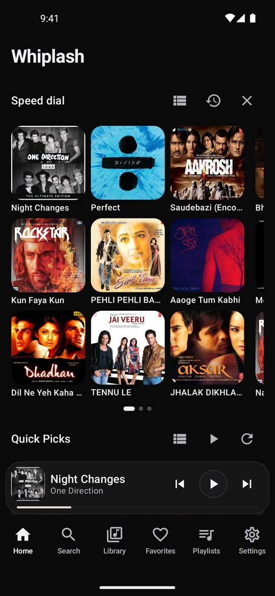
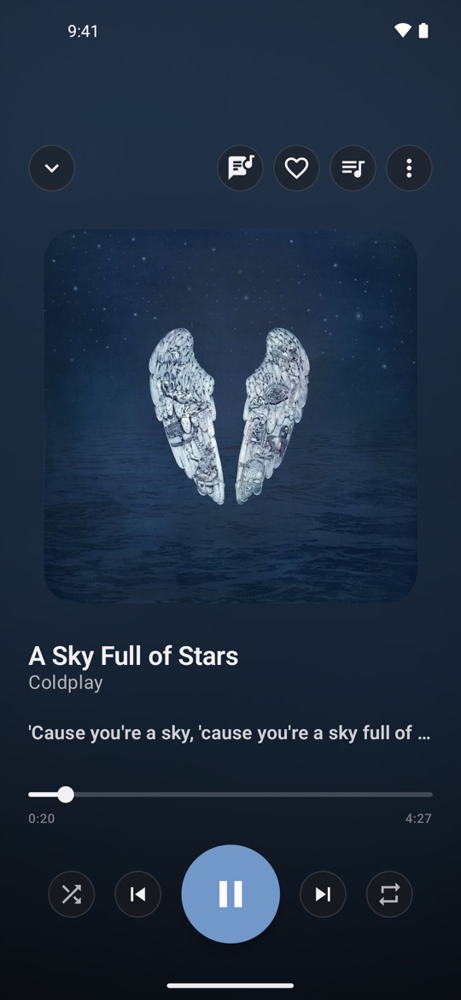
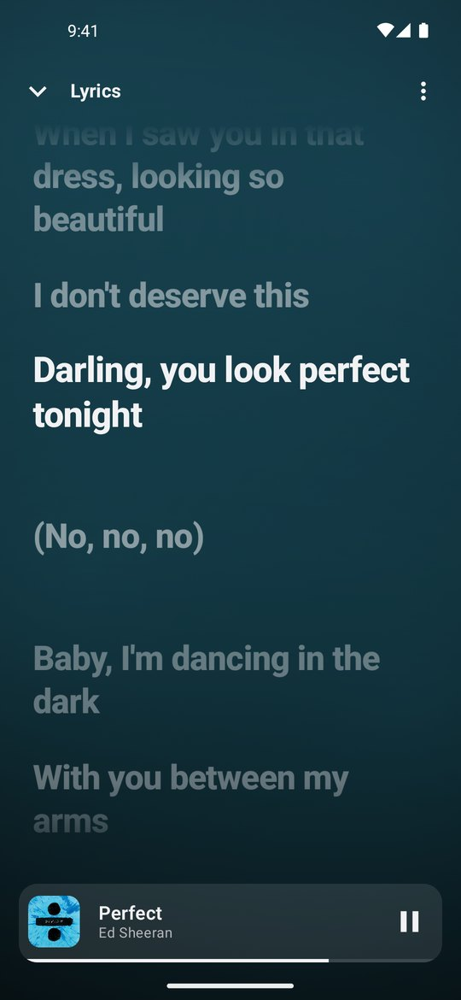
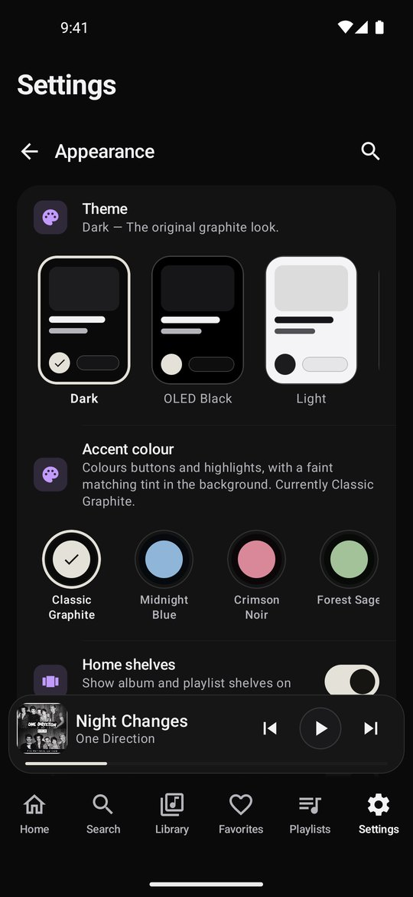

<div align="center">


# Whiplash

**A native Android music player for YouTube Music and your own songs.**

Designed and built from scratch by **Shahid Ansari** with Kotlin, Jetpack Compose and Media3.

[](https://github.com/shahidthisside/Whiplash/releases/latest)


[](LICENSE)

[Download](https://github.com/shahidthisside/Whiplash/releases/latest) · [Website](https://shahidthisside.github.io/Whiplash/) · [Changelog](CHANGELOG.md) · [Privacy](https://shahidthisside.github.io/Whiplash/privacy.html)

</div>

> **Proprietary software. All rights reserved.** The source code is published so it can be read. It may not be copied, modified, renamed, re-skinned, rebuilt, redistributed, or used to train or prompt AI models. See [LICENSE](LICENSE) and [NOTICE](NOTICE).

---

## Contents

- [What's new in 1.1.0](#whats-new-in-110)
- [Screenshots](#screenshots)
- [Features](#features)
- [Stream sources](#stream-sources)
- [Settings](#settings)
- [Privacy](#privacy)
- [Architecture](#architecture)
- [Tech stack](#tech-stack)
- [Known limitations](#known-limitations)
- [Disclaimer](#disclaimer)
- [License](#license)

---

## Download

Get the signed APK from the [Releases page](https://github.com/shahidthisside/Whiplash/releases/latest) or the [Whiplash website](https://shahidthisside.github.io/Whiplash/). It needs Android 8.0 or newer, and installs as an update over earlier versions.

Only APKs from these two places are official. They are signed with the author's own key; the certificate fingerprint is listed in [NOTICE](NOTICE).

---

## What's new in 1.1.0

1.1.0 is the biggest update so far.

- **Redesigned app:** a new Now Playing screen, navigation bar and mini player, and new Home, Search, Library, Favorites, Playlists and Settings pages.
- **Eight themes**, including Liquid Glass.
- **Autoplay and Quick Picks that learn** what you finish and skip.
- **Full-screen synced lyrics** with word-by-word highlighting.
- **Monthly Replay** and **optional Google Drive sync**.
- **A second stream source** (YouTube direct), and a playback engine built for weak connections.

The full list is in the [changelog](CHANGELOG.md).

---

## Screenshots

<div align="center">

| Home | Now Playing | Lyrics | Themes |
|:---:|:---:|:---:|:---:|
|  |  |  |  |

</div>

---

## Features

### Playback
- Background playback through a real `MediaSessionService` and ExoPlayer, with lock screen, notification, headset and Bluetooth controls.
- Play from the notification or a headset always resumes, even after the app was closed or the connection dropped.
- The queue, and where you were in the current song, are kept after the app closes.
- Gapless playback, fade between tracks, playback speed from 0.5x to 2x, and Skip Silence.
- A sleep timer: fixed times, end of song or end of queue.
- Previous restarts the song after its first 3 seconds.
- Separate audio quality for Wi-Fi and mobile data, an audio cache for instant replays, and an audio output picker in the player menu.
- Stats for nerds: where the audio comes from, its format and bitrate.

### Built for weak connections
- A lighter stream is picked automatically on a slow link.
- A dropped connection is retried while the song keeps playing.
- The likely next songs are looked up before you tap them.
- Song lookups are kept small, and calls to YouTube Music have a time limit.

### Autoplay and recommendations
- Autoplay starts a YouTube Music radio for the song you play, falling back to NewPipe.
- Songs are ranked on the device by mood, genre, energy, era and language.
- The radio learns from what you finish and skip, which artists go together, and what you play at each time of day.
- Re-uploads, lyric videos and music videos of a song you already have are dropped, and the official audio is preferred.
- Settings › Reset recommendations forgets what the radio learned.

### Home
- **Speed dial:** pinned and recently played songs, in pages, as a grid or list.
- **Quick Picks:** built from the radios of songs you finish and YouTube Music's "You might also like", with Play all.
  - Both appear instantly on launch from their last saved copy.
  - Quick Picks refresh only when the list is a few hours old, on a new day, or when your listening has moved, and never change while you're using them.
- Optional album and playlist shelves, and pull to refresh.

### Now Playing and lyrics
- Colours from the album art with a drifting backdrop, and an optional full-bleed cover.
- Swipe the cover to skip, and drag down to close.
- Five seek bar styles: Classic, Wavy, Waveform, Minimal and Hairline.
- Full-screen synced lyrics, opened by swiping up on the player.
  - Word-by-word highlighting.
  - Optional blur of the other lines.
  - Per-song timing.
  - The current line above the seek bar, if you want it.
- Lyrics come from LRCLIB with lyrics.ovh as a fallback. They're cached for offline use and never made up.
- The queue has sections (played, now playing, from autoplay), drag to reorder, swipe to remove with undo, and shuffle up next.

### Search and Explore
- Search songs, albums, artists and playlists, with suggestions, recent searches and infinite scroll.
- Modern album, artist and playlist pages, with Play, Shuffle, Start radio, Download and Share.
- Explore: new releases, charts, and mood and genre pages.

### Library
- A Library start page with Downloads, Songs, Albums, Artists, History and Shuffle all.
- Your own on-device music (MediaStore), refreshed automatically when files change.
- Offline downloads with embedded tags and cover art, Wi-Fi-only downloads, Download album/playlist, and Save to device.
- Playlists:
  - custom covers (photo crop)
  - pinning
  - grid or list view
  - import from a YouTube or YouTube Music link
- Favorites, including adding or removing a whole album or playlist.
- Multi-select across song, album and playlist lists.

### Monthly Replay
- A recap of your month: top songs, top artists and listening time, shown as a story.
- A poster you can share, and Play top songs.

### Look and feel
- Eight themes:
  - Dark
  - OLED Black
  - Light
  - Liquid Glass
  - Catppuccin Mocha
  - Nord
  - Rosé Pine Dawn
  - Custom
- Accent colours with a colour picker.
- Liquid Glass: see-through glass with adjustable tint and lens strength, and a glass player and tab bar.
- Reduce animations, for less motion.
- First-run onboarding: pick your languages, genres and artists, so Home is personal from the first launch.

### Backup and sync
- Local backup and restore by category: playlists, favorites, history, pinned songs, downloads and settings.
- Optional Google Drive sync of playlists, favorites, history, Speed dial and settings.
  - Your data is kept in a private app folder in your own Drive.
  - Changes made offline sync when you're back online.
  - You can switch sync off, by category or entirely.

---

## Stream sources

Whiplash can get a song's audio in two independent ways:

| Source | How it works |
|---|---|
| **NewPipe** | Extracts the stream with NewPipeExtractor. The default, and the most resilient long term. |
| **YouTube direct** | Asks YouTube directly for the stream, often faster to start. |

In **Settings › Stream source** you can choose:
- **Automatic** (default): NewPipe first, then YouTube direct if a song won't play.
- **NewPipe only**.
- **YouTube direct only**.

The page also shows which source played the last song. If one source breaks after a YouTube change, the other usually keeps playback working.

---

## Settings

Settings are searchable and grouped into sections:

| Section | What's in it |
|---|---|
| **Audio quality** | Streaming quality, separate Wi-Fi and mobile data quality |
| **Stream source** | Automatic, NewPipe or YouTube direct |
| **Playback** | Autoplay, Reset recommendations, gapless, Skip Silence, crossfade, playback speed, system equalizer |
| **Downloads** | Download quality, Wi-Fi-only downloads |
| **Now Playing** | Seek bar style, artwork colours, full-bleed cover, Stats for nerds |
| **Lyrics** | Lyric line in the player, swipe up for lyrics, blur, lyrics source |
| **Appearance** | Theme, accent colour, Liquid Glass tint and lens, Speed dial and Quick Picks layout, Reduce animations |
| **Account & sync** | Google sign-in and Drive sync |
| **Storage** | Cache songs, cached data, downloaded songs, Reset app |
| **Backup & Restore** | Back up and restore by category |

The start page also has Quit Whiplash.

---

## Privacy

- No ads, no analytics, no tracking, and no Whiplash servers.
- Your library stays on your phone. With sync on, it's stored in your own Google Drive.
- Requests for music go straight from your phone to YouTube, and requests for lyrics to LRCLIB or lyrics.ovh.

Details are in the [privacy policy](https://shahidthisside.github.io/Whiplash/privacy.html).

---

## Architecture

```
UI (Compose)  →  ViewModel  →  PlaybackController  →  MediaController  →  MediaSessionService (ExoPlayer)
                                      │
                                      ├── PlaybackManager (stream sources with fallback)
                                      │      ├── NewPipe (NewPipeExtractor)
                                      │      └── YouTube direct
                                      ├── RadioEngine + InnerTube client (autoplay and Quick Picks)
                                      ├── LibraryRepository / LocalLibraryRepository (Room + MediaStore)
                                      ├── SettingsRepository (DataStore)
                                      ├── Lyrics providers (LRCLIB, lyrics.ovh)
                                      └── Backup and Google Drive sync
```

---

## Tech stack

| Layer | Technology |
|---|---|
| Language | Kotlin, coroutines |
| UI | Jetpack Compose, Material 3 |
| Playback | AndroidX Media3 (ExoPlayer, MediaSession) |
| YouTube | NewPipeExtractor, YouTube direct, and a small YouTube Music (InnerTube) client |
| Storage | Room, DataStore |
| Networking | OkHttp |
| Images | Coil |
| Lyrics | LRCLIB, lyrics.ovh |
| Sync | Google Drive (Google Play services sign-in) |
| Performance | Baseline profile |
| Tests | 280 unit tests (JUnit) |

**Minimum SDK:** 26 (Android 8.0) · **Target SDK:** 36

---

## Known limitations

- YouTube access relies on unofficial extraction. YouTube can change its systems at any time, which may need an app update; the second stream source makes this less likely to stop playback.
- Networks with YouTube Restricted Mode (common on school and office Wi-Fi) block some songs.
- Some vendor skins (for example Vivo/iQOO OriginOS) limit which apps appear in their own media pickers. Whiplash uses the standard Android media session, so this is outside the app's control.
- The app is portrait only.

---

## Disclaimer

Whiplash accesses publicly available YouTube and YouTube Music content and is intended for personal use. It is not affiliated with, endorsed by or sponsored by YouTube, Google, LRCLIB or lyrics.ovh. Users are responsible for following YouTube's Terms of Service where they live.

---

## License

**Copyright (c) 2026 Shahid Ansari. All rights reserved.**

Whiplash is proprietary software under the [Whiplash Proprietary License](LICENSE). Every file in this repository that isn't a third-party library is covered by it, and each source file carries the copyright notice.

- **Allowed:** reading the code, and installing the official APK for personal use.
- **Not allowed without written permission:**
  - copying, modifying, renaming, re-skinning, rebuilding, redistributing or selling it
  - presenting it as your own
  - using it to train, prompt or feed AI systems

Versions before 1.1.0 were published under the MIT License, and copies obtained under it stay under it. For permission requests, contact [@shahidthisside](https://github.com/shahidthisside).

## Acknowledgements

Whiplash uses these libraries and services, which remain under their own licenses:

- [NewPipeExtractor](https://github.com/TeamNewPipe/NewPipeExtractor): YouTube and YouTube Music extraction
- [AndroidX Media3](https://github.com/androidx/media): ExoPlayer and MediaSession
- [LRCLIB](https://lrclib.net) and [lyrics.ovh](https://lyrics.ovh): lyrics
- [Coil](https://github.com/coil-kt/coil), [OkHttp](https://github.com/square/okhttp) and [Room](https://developer.android.com/jetpack/androidx/releases/room)
